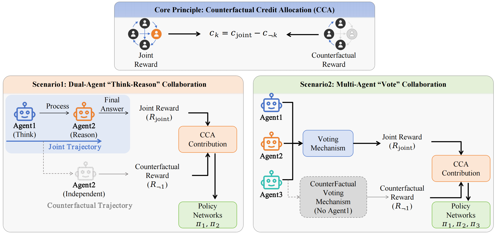

# CCPO：面向多智能体协作的反事实信用策略优化

[**English README**](README.md)


协作式多智能体大语言模型（LLM）能够通过角色分解和多样化假设聚合来解决复杂的推理任务。然而，此类系统的强化学习（RL）训练常常受到信用分配问题的困扰：共享的全局奖励掩盖了个体贡献，导致更新方差增大并助长"搭便车"现象。我们提出了**反事实信用策略优化（Counterfactual Credit Policy Optimization, CCPO）**，一个通过反事实轨迹估计每个智能体边际贡献来分配个体学习信号的框架。CCPO 构建动态反事实基线，模拟移除某个智能体贡献后的结果，从而产生角色敏感的优势函数用于策略优化。为了进一步提升在异质任务和数据分布下的稳定性，我们提出了一种**全局历史感知归一化方案**，利用全局采样统计量校准优势函数。我们在两种协作拓扑上评估了 CCPO：顺序式 Think-Reason 二元组和多智能体投票。在数学和逻辑推理基准测试中，CCPO 有效缓解了搭便车现象，并优于强多智能体 RL 基线，实现了更精细、更有效的协作 LLM 训练信用分配。

## 框架

<p align="center">
  
</p>


## 项目结构

```
.
├── assets/                          # 图片和示意图
├── data/                            # 训练和评测数据集
│   ├── MATH/                        # MATH 数据集（训练/测试划分）
│   ├── aime2024_fixed_with_prompt.parquet
│   ├── aime2025_fixed_with_prompt.parquet
│   └── ...
├── prompt/                          # 数学推理的 prompt 模板
├── scripts/
│   ├── rl/separated_rema/           # RL 训练脚本
│   ├── sft/                         # 监督微调脚本
│   ├── eval/                        # 评测脚本
│   └── deepspeed/                   # DeepSpeed 配置
├── src/
│   ├── verl/                        # 核心训练框架（基于 verl）
│   │   └── verl/
│   │       ├── rema_separated_trainer/  # 双智能体分离式训练器
│   │       │   ├── main_ppo.py          # 主入口
│   │       │   └── ppo/
│   │       │       ├── ray_trainer.py   # RayReMASeparatedTrainer
│   │       │       └── multi_agent_rollout.py
│   │       └── workers/
│   │           └── reward_manager/
│   │               ├── leave_one_out_rema.py    # Leave-one-out 奖励
│   │               └── historical_normalizer.py # EMA 归一化
│   └── 360-LLaMA-Factory/          # LLaMA-Factory（用于 SFT）
├── requirements.txt
└── README.md
```

## 安装

**环境要求**：Python 3.12，CUDA 12.4

### 1. 安装 Flash Attention

```bash
pip install flash_attn-2.7.4.post1+cu12torch2.6cxx11abiFALSE-cp310-cp310-linux_x86_64.whl
```

### 2. 安装 verl（可编辑模式）

```bash
cd src/verl
pip install -e .
```

### 3. 安装其余依赖

```bash
pip install -r requirements.txt
```

## 快速开始

### 训练

使用 Qwen2.5-7B 在 MATH-500 上运行示例训练脚本：

```bash
bash scripts/rl/separated_rema/example_test500_qwen2_5_7b.sh
```

运行前请修改脚本中的本地路径：

```bash
# 设置工作目录
cd /path/to/your/project

# 设置模型路径（两个智能体可以使用相同的模型）
MODEL_PATH_1="/path/to/Qwen2.5-7B-Instruct"
MODEL_PATH_2="/path/to/Qwen2.5-7B-Instruct"
```

### 关键训练参数

| 参数 | 说明 | 默认值 |
|------|------|--------|
| `reward_model.reward_manager` | 奖励管理器类型 | `leave_one_out_rema` |
| `reward_model.use_historical_normalization` | 是否启用 EMA 归一化 | `True` |
| `reward_model.ema_decay` | EMA 衰减因子 | `0.99` |
| `reward_model.alpha` | 智能体 1 奖励缩放因子 | `1.0` |
| `reward_model.eta` | 智能体 2 奖励门控参数 | `1.0` |
| `algorithm.switch_agent.enable` | 是否启用交替训练 | `True` |
| `algorithm.switch_agent.freq` | 切换频率（步数） | `10` |
| `algorithm.adv_estimator` | 优势估计器 | `grpo` |
| `actor_rollout_ref.rollout.n` | 采样数量 | `4` |
| `actor_rollout_ref.actor.clip_mode` | PPO 裁剪模式 | `turn` |
| `trainer.total_epochs` | 总训练轮数 | `10` |

## 致谢

本项目基于以下开源项目构建：

- [ReMA](https://github.com/ziyuwan/ReMA-public) - 强化多智能体训练框架
- [verl](https://github.com/volcengine/verl) - 火山引擎大模型强化学习框架
- [Qwen2.5](https://github.com/QwenLM/Qwen2.5) - Qwen2.5 系列模型
- [vLLM](https://github.com/vllm-project/vllm) - 高效大模型推理引擎

## 引用

如果您觉得本工作有帮助，请考虑引用：

```bibtex
@misc{ccpo2025,
  title={Counterfactual Credit Policy Optimization for Multi-Agent Collaboration},
  year={2025}
}
```
